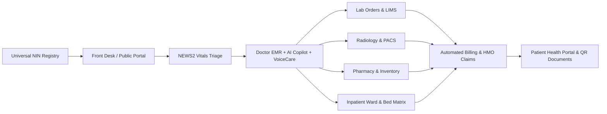

# HospNest — The Intelligent Operating System for Modern Hospitals 🏥✨

> **HospNest** is an enterprise-grade, multi-tenant hospital management platform (HMIS/EMR) designed for modern healthcare facilities, clinics, and health networks. Powered by **NIN-based Universal Patient Identity**, **Intron Sahara African Dialect Speech AI (VoiceCare™)**, **NEWS2 Clinical Triage**, **LIMS**, **PACS/Radiology**, **Pharmacy Inventory**, and **QR-Verifiable Clinical Documentation**, HospNest bridges the gap between frontline clinical care and operational intelligence.

---

## 🌟 Executive Summary & Vision

HospNest transforms healthcare operations by eliminating siloed records, long patient queues, medication errors, and language barriers in clinical consultations.



---

## 🚀 Key Modules & Capabilities

### 1. 🆔 Universal Patient Identity (NIN-Powered)
- **National Identity Number (NIN) Integration**: Eliminates duplicate charts across hospital networks with unique national identifier resolution.
- **Cross-Facility Longitudinal Records**: Complete medical history, chronic conditions, verified allergies, previous admissions, and immunization logs.
- **Biometric / Quick Search**: Instant lookup by NIN, Hospital File Number, Phone, or Full Name.

---

### 2. 🎙️ HospNest VoiceCare™ & Speech AI Suite
Built specifically for multilingual African healthcare environments:
- **African Dialect Speech-to-Intent**: Real-time voice processing supporting **Nigerian Pidgin, Yoruba, Hausa, Igbo, Kenyan Swahili**, and heavy regional English accents via **Intron Sahara CodeSwitch AI**.
- **Voice-Powered Patient Booking**: Patients can schedule consultations using natural voice prompts in their dialect.
- **Voice Check-In & Triage**: Hands-free symptom intake for incoming patients.
- **Doctor Voice Consultation Notes**: Automated ambient clinical dictation converting doctor speech into structured SOAP notes.
- **VoiceCare Benchmark Lab**: Integrated speech evaluation laboratory measuring **WER (Word Error Rate)**, **CER (Character Error Rate)**, **Slot F1 Accuracy**, latency, and acoustic noise robustness across audio datasets with downloadable PDF/JSON reports.

---

### 3. ⏱️ Front Desk, Queues & Public Hospital Portals
- **Multi-Channel Registration**: Walk-ins, self-service patient onboarding, and QR check-ins.
- **Live Queue Orchestration**: Dynamic queueing categorized by emergency priority, department, and doctor availability.
- **Branded Hospital Landing Pages (`/hospitals/:slug`)**: Dedicated public booking micro-sites for each hospital with doctor directories and instant appointment booking.

---

### 4. 🩺 Triage & NEWS2 Clinical Safety Engine
- **Automated NEWS2 Score Calculation**: Instant early warning score calculation from Respiratory Rate, SpO2, Oxygen Therapy, Systolic BP, Heart Rate, Consciousness (AVPU), and Temperature.
- **Clinical Risk Stratification**: High-risk, Medium-risk, and Low-risk visual badges with automated protocol escalation triggers.
- **Offline Vitals Recording & Resilient Sync**: Uninterrupted offline vital sign data entry with background synchronization when network reconnects.

---

### 5. 📋 Consultations & Electronic Medical Records (EMR)
- **Full SOAP Documentation**: Subjective history, Objective exam findings, Assessment, and Plan documentation.
- **ICD-10 Diagnostic Catalog**: Standardized clinical disease coding with auto-complete search.
- **AI Clinical Copilot**: Instant summaries of complex patient history, diagnostic suggestions, and treatment outline assistance.
- **Real-Time Drug Interaction Alerts**: Automated checks for severe drug-drug contraindications and patient allergy conflicts prior to prescription dispatch.
- **Clinical Amendments & Audit Trails**: Tamper-evident addendums with doctor timestamps for medico-legal integrity.

---

### 6. 🛏️ Inpatient Admissions, Wards & Bed Matrix
- **Visual Bed Grid**: Real-time bed occupancy status across **General, Semi-Private, Private, ICU, Maternity, and Isolation** wards.
- **Admission Lifecycle**: Bed allocation, daily clinical ward rounds logging, vitals charting, medication administration, and discharge summaries.
- **Inter-Ward & Inter-Facility Transfers**: Clinical handover documentation, transfer approvals, and ambulance dispatch status.

---

### 7. 👶 Maternity & Antenatal Care (ANC)
- **ANC Tracking**: Gravidity, parity, estimated date of delivery (EDD), and gestational age calculators.
- **Labor & Delivery Documentation**: Maternal vitals monitoring, fetal heart rate logging, APGAR scoring, and newborn birth registration.
- **Immunization Schedule**: Childhood vaccine tracker mapped to national health schedules.

---

### 8. 🔬 Laboratory Information Management System (LIMS)
- **Electronic Lab Orders**: Direct requisition routing from consultations to laboratory benches.
- **Sample Collection & Tracking**: Specimen logging with barcode/accession IDs.
- **Result Validation & Reference Ranges**: Normal range boundaries with automatic abnormal/critical value flags.
- **Printable Lab Reports**: Laboratory reports with tamper-evident QR verification.

---

### 9. 🩻 Radiology & Medical Imaging (PACS)
- **Imaging Requisitions**: X-Ray, Ultrasound, CT, MRI, and Mammography workflows.
- **Medical Image Viewer**: Built-in DICOM and high-resolution imaging viewer with zoom, pan, contrast, and inversion controls.
- **Radiologist Reporting**: Structured findings, impressions, and digital sign-offs.

---

### 10. 💊 Pharmacy Dispensary & Inventory Engine
- **Digital Prescription Dispensing**: Direct fulfillment queue from doctor consultations.
- **Batch & Expiry Date Management**: Expiry alerts, FIFO batch tracking, and spoilage prevention.
- **Real-Time Stock Depletion**: Automatic stock level deduction upon dispensing with minimum reorder thresholds and low-stock alerts.

---

### 11. 💳 Billing, Invoicing & HMO Claims
- **Automated Bill Aggregation**: Automatic billing for consultations, lab tests, medications, bed days, and procedures.
- **Insurance & HMO Management**: Pre-authorization tracking, policy copays, and claim adjudication workflows.
- **Payment Processing & Receipts**: Cash, POS, transfer, and card payment logging with official QR-verified PDF receipts.

---

### 12. 📱 Patient Self-Service Portal (`/portal`)
- **Complete Health Dashboard**: Access medical history, doctor notes, lab results, radiology reports, and active prescriptions.
- **Online Appointment Booking**: Book, reschedule, and manage upcoming hospital visits.
- **Financial Statements**: View invoices, track payments, and download official receipts.

---

### 13. 📄 Clinical Documents & Tamper-Evident QR Suite
- **Official Medical Documents**:
  - Medical Fitness Certificates
  - Sick Leave & Duty Exemption Letters
  - Medical Referral Letters
  - Inpatient Discharge Summaries
  - Payment & Billing Receipts
  - Diagnostic & Radiology Reports
- **Universal QR Verification**: Encrypted QR verification badges on all printed documents allowing third parties (employers, insurers, referral hospitals) to authenticate documents instantly.

---

### 14. 🛡️ Super Admin Global Command Center (`/superadmin`)
- **Multi-Tenant Network Telemetry**: Global hospital registry, verification approvals, subscription tiers, and resource utilization.
- **Global Financial Analytics**: Platform revenue streams, active hospital subscriptions, and transaction volumes.
- **System Audit Ledger**: Immutable audit log of all clinical record accesses, modifications, logins, and permission changes for strict regulatory compliance.

---

## 👥 Role-Based Access Control (RBAC)

| Role | Core Capabilities |
| :--- | :--- |
| **Super Admin** | Multi-tenant hospital approvals, platform analytics, global settings, VoiceCare lab configuration, audit oversight. |
| **Hospital Admin** | Hospital setup, staff roster & shift management, departmental configuration, billing rates, financial reports. |
| **Doctor** | EMR consultations, SOAP notes, ICD-10 coding, prescription writing, lab/radiology orders, ward rounds, VoiceCare notes. |
| **Nurse** | NEWS2 triage & vitals recording, bed management, medication administration, inpatient care, ANC monitoring. |
| **Lab Technician** | Specimen accessioning, diagnostic test execution, result verification, lab report publication. |
| **Pharmacist** | Prescription verification, drug dispensing, inventory restocking, batch tracking, expiry monitoring. |
| **Patient** | Health portal access, booking appointments, viewing lab results, downloading prescriptions & QR receipts. |

---

## 💻 Technology Stack & Architecture

- **Frontend**: React 19, TanStack Start (SSR/Fullstack), TanStack Router, TanStack Query
- **Styling & UI**: Tailwind CSS v4, shadcn/ui, Lucide React, Motion (Framer Motion), Recharts
- **Backend & Database**: Supabase PostgreSQL, Row Level Security (RLS), Server Functions (`@tanstack/react-start`)
- **Speech & AI Engine**: Intron Sahara African Dialect Speech-to-Intent API, Web Speech API, OpenAI Whisper Fallback
- **Safety & Verification**: NEWS2 clinical scoring engine, drug-drug contraindication validator, QR verification cryptographic engine
- **Type Safety**: TypeScript 5.8+, Zod validation schemas

---

## 🛠️ Local Development & Setup

### Prerequisites
- Node.js (v20+ recommended)
- Bun or npm

### Installation
```bash
# 1. Clone repository
git clone <repository-url>
cd hospnest

# 2. Install dependencies
bun install
# or: npm install

# 3. Configure environment variables
cp .env.example .env
# Fill in your Supabase URL, Anon Key, and Intron AI API Key

# 4. Run development server
bun dev
# or: npm run dev
```

---

## 🔒 Security, Privacy & Compliance
- **Data Isolation**: Strict multi-tenant Row Level Security (RLS) guaranteeing zero cross-tenant data leakage.
- **Full Audit Trails**: Every clinical record view, edit, and export is timestamped and logged with user ID, role, and hospital ID.
- **Role Scoping**: Granular, role-enforced access gates preventing unauthorized exposure of clinical, financial, or administrative data.

---

Built with ❤️ for resilient, intelligent, and inclusive healthcare systems.
